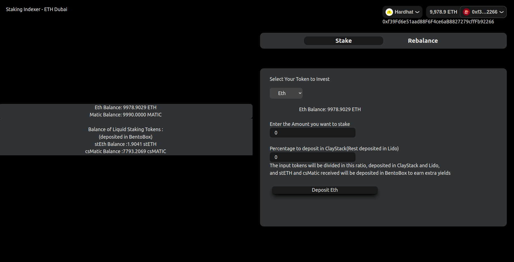
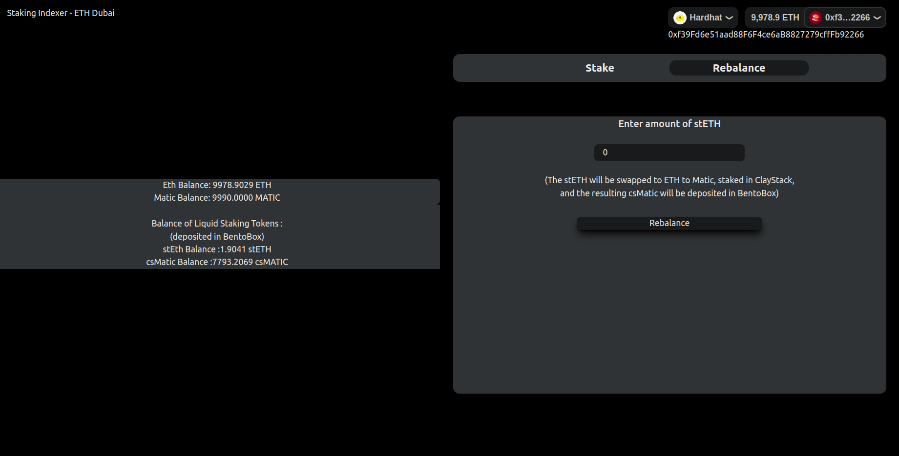

# Staking Indexer 

We have created an optimized Staking Indexer, which takes funds in any token, divides the funds into parts, deposit them into Liquid Staking Protocols Lido and ClayStack, and deposit the liquid staking tokens stETH and csMatic into **BentoBox** to earn extra yields. 

We also provide easy to use rebalancing feature to convert stETH into csMatic, which involves withdrawing from bentoBox, converting stETH-> ETH -> Matic, depositing the matic into ClayStack, and depositing the csMatic tokens back in BentoBox. 

Here is the invest screen - 

The user can invest in 2 tokens, Eth and Matic (It can be extended to more tokens easily) and can invest in two liquid staking protocols - ClayStack and Lido (this is also easily extensible). The user can invest any one token, which is converted into other token based on preference before depositing.  

The user can also easily rebalance, to convert his stETH into csMatic deposited in bentoBox if ClayStack in providing better yields in just a single transaction -

You can check out the demo video <a href="https://www.youtube.com/watch?v=bCumr6SLm_s">here</a>

***Note*** : As it was difficult to find all the contracts on a single test network, we performed tests on Mainnet using Hardhat to fork mainnet. We used **Infura** archive RPC url to achieve that.